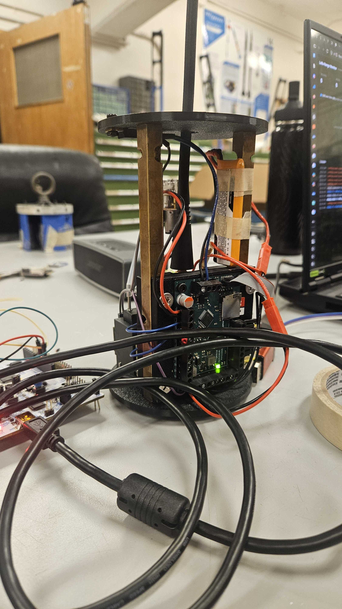
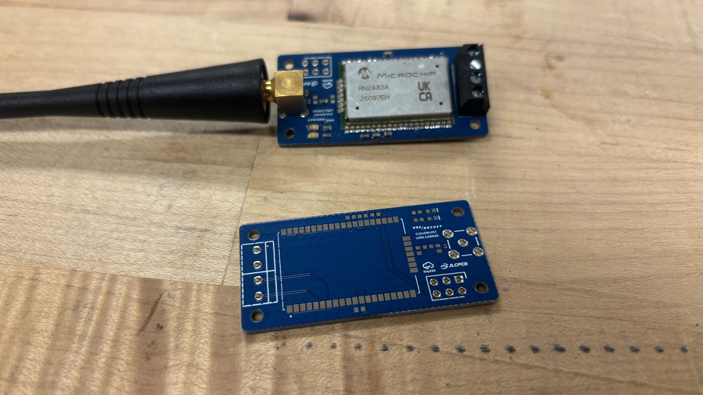
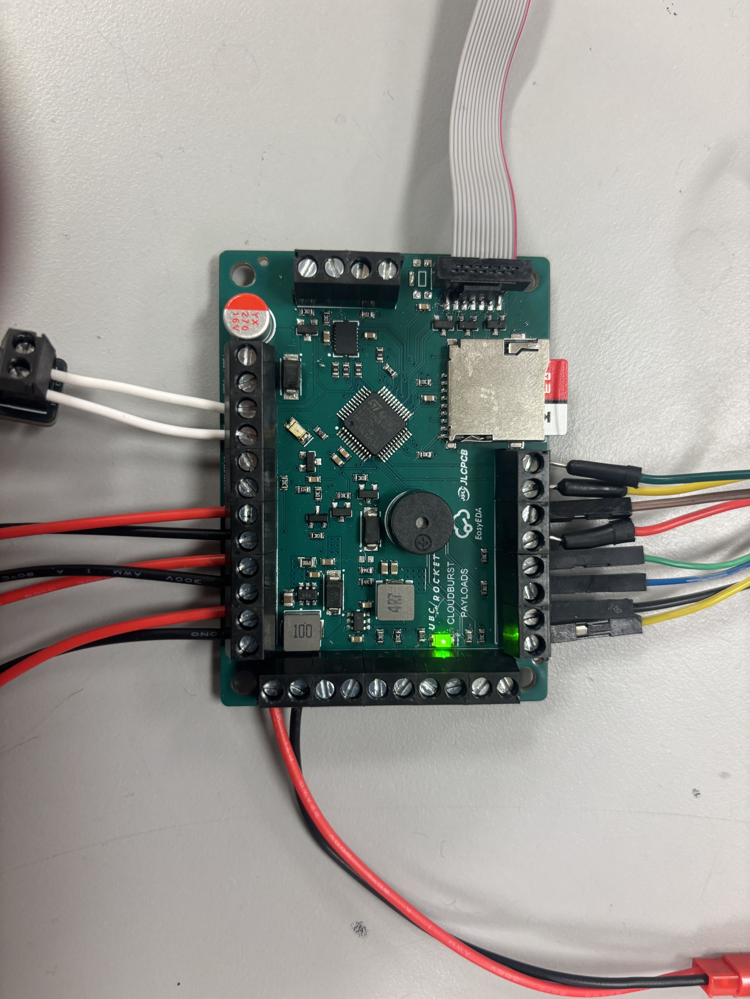

# Payloads firmware

Firmware for UBC Rocket's Cloudburst payload on the STM32G0B1CCT6. It reads from the accelerometer and UV sensor to create a table to determine the effects of gravity on microtubulin. This experiment is happening in Cloudburst's nosecone, and to control it from a safe distance at the launch site, we're using the RN2483A LoRa Module. 

## PCB Fabrication

<table>
  <tr>
    <td width="33.33%" align="center">
      
    </td>
    <td width="33.33%" align="center">
      
    </td>
    <td width="33.33%" align="center">
      
    </td>
  </tr>
</table>


The boards for this design were made possible with the support of [JLCPCB](https://jlcpcb.com/) and [EasyEDA](https://easyeda.com/). Their excellent turnaround times and affordable manufacturing costs made it possible to quickly iterate on these designs and produce high-quality PCBs in time for [Launch Canada 2026](https://www.launchcanada.org/)!

We're incredibly grateful to JLCPCB and EasyEDA for their support towards Cloudburst's Payloads electronics.

<table>
  <tr>
    <td width="25%">
      
    </td>
    <td width="75">
      
    </td>
  </tr>
</table>


## Build

The receiver must use the same raw-LoRa profile as the transmitter. The known
module frequency defaults to 433575000 Hz; CMake requires the remaining values
rather than silently building a receiver with guessed RF settings. For example:

```sh
cmake --preset Debug \
  -DRN2483_RADIO_SF=12 \
  -DRN2483_RADIO_BW_KHZ=125 \
  -DRN2483_RADIO_CR=5 \
  -DRN2483_RADIO_SYNC_WORD=0x34
cmake --build --preset Debug
```

Replace the example values with the transmitter's spreading factor, bandwidth,
coding-rate denominator, and sync byte. The frequency can still be overridden
with `-DRN2483_RADIO_FREQ_HZ` when needed. The ELF is written to
`build/Debug/Payloads.elf`.

## Runtime behavior

- The BMI088 accelerometer on SPI1 runs at ±6 g, 100 Hz, and normal bandwidth.
  Its 1024-byte FIFO is drained every 20 ms so short SD-card stalls do not lose
  acquisition timing.
- The single LTR390 is addressed only through the configured 100 kHz I2C3
  interface on PB3/PB4. It runs in UV mode at 20-bit resolution, a 500 ms
  measurement period, and 18x gain. The
  logged value is the coherent raw 20-bit count; converting it to ambient UVI
  requires a calibrated optical-window factor for the assembled payload. I2C3
  must have the datasheet-recommended 1 kOhm to 10 kOhm pull-ups
  on SDA and SCL; MCU-internal pull-ups are not a substitute.
- PA0 drives the passive buzzer from TIM2 channel 1. At startup it plays a
  monophonic transcription of measures 1-17 from the supplied first page of
  Tony Ann's "The Interstellar Experience" at quarter note = 99, including its
  printed dynamics, accents, crescendo, note values, and final half rest. At
  the score's right-hand dyads, the passive buzzer plays the accented upper
  note because one buzzer cannot emit both pitches simultaneously. It then
  stops the buzzer output low. TIM2 no longer drives the UV LED.
- PD1 is the `UVLED_CTRL` GPIO and is driven high during startup.
  It is a binary GPIO controlled by `LED_ON` and `LED_OFF`; it is not connected
  to a timer channel and PWM commands are not supported.
- A preformatted FAT16 or FAT32 SD card on SPI2 is mounted without formatting.
  Each boot creates the first free `LOG0000.CSV` through `LOG9999.CSV`, buffers
  records in RAM, writes in batches, and synchronizes once per second. Failed
  cards are retried every five seconds while acquisition continues. On each
  pump off-to-on transition, queued pre-pump records are flushed to the current
  file and logging continues in the first free `EXP0000.CSV` through
  `EXP9999.CSV`. Repeated `PUMP_ON` packets while the pump is already on do not
  create extra files.
- USART2 uses the RN2483 default of 57600 baud. Startup sends the RN2483 break
  and `0x55` synchronization sequence, pauses the MAC, applies and reads back the
  required raw-LoRa profile at 433575000 Hz, then enters continuous receive
  mode.
- The payload disables the RN2483 radio watchdog and uses continuous reception,
  as required by the module command reference. After a received packet or a
  module-reported receive error, it immediately opens a new receive session. It
  does not transmit periodic traffic. A received `PING` is the only link-check
  request and causes a one-shot `PONG` reply after a short turnaround delay.
- USART1 on PA9/PA10 is the 115200-baud debug console. Its TX output reports
  the configured radio profile at boot, radio state and receive counters once
  per second, and an immediate `EVENT ... applied` line when an output command
  is applied. Each new LTR390 conversion prints `UV sample` with its timestamp,
  raw count, validity, counters, and I2C3 bus number; failed reads print
  `UV read` diagnostics. The range monitor displays these lines without special
  parsing.
- `PUMP_ON` and `PUMP_OFF` independently control the PD2 pump output.
  `BUMP <seconds>` turns the pump on for 1 through 3600 whole seconds, then
  turns it off without blocking sensor acquisition, logging, or radio work.
  A later `PUMP_ON`, `PUMP_OFF`, or `BUMP` supersedes the active bump timer.
  `LED_ON` and `LED_OFF` independently control the PD1 LED output; PWM commands
  are not accepted. `PING` leaves both outputs unchanged and replies with
  `PONG`. These are the only accepted radio
  payloads. An optional transmitted CR, LF, or CRLF terminator is ignored so
  line-oriented serial bridges work. Other malformed or unknown packets leave
  both outputs unchanged. The pump starts low and the UV LED starts high; both are
  forced low by `Error_Handler`.

The STM32F103 ground bridge lives under `range-test-rx/range-test-rx`. Its
ST-Link VCP uses USART2 at 115200 baud and accepts CR/LF-terminated `PUMP_ON`,
`PUMP_OFF`, `BUMP <seconds>`, `LED_ON`, `LED_OFF`, and `PING` lines from
`range-monitor.html`. Reception is interrupt-driven,
so commands are retained while the RN2483 is listening. Between two-second
receive slices the bridge converts the command to a raw-LoRa hex payload. Output
commands are transmitted three times with the same
SF12/BW125/CR4/5/sync-0x34
profile; `BUMP` and `PING` are transmitted once. The bridge waits for each `radio_tx_ok`
and returns to receive mode. Repetition gives each idempotent output command extra
link margin without restarting a timed bump. Ping success is only
reported after the payload returns `PONG`. `BRIDGE SERIAL RX ...` confirms the
browser line reached the F103; `BRIDGE RADIO TX ... OK` confirms the bridge's
RN2483 completed all transmissions (it is not an acknowledgement from the
payload).

SPI2 is configured in the `.ioc` for eight-bit SPI mode 0 at 250 kHz with
software-controlled chip select. PA4 is an initially-high `SD_CS` GPIO, and
PB13 through PB15 are high-speed SPI2 pins, with a pull-up on PB14/SD MISO so the
line has a defined idle level while the card's output is high impedance. The SD
transport reapplies the startup configuration on retries and switches SPI2 to
8 MHz after card initialization.
Initialization tries SPI mode 0 first, then retries CMD0 in SPI mode 3 when the
card does not respond; the successful mode is retained at data speed.

## Log format

`time_ms` is monotonic milliseconds since MCU startup; there is no real-time
clock in the `.ioc`. A row is emitted for every 100 Hz accelerometer sample:

```text
time_ms,accel_x_raw,accel_y_raw,accel_z_raw,uv_raw,accel_valid,uv_valid,uv_new,sensor_error_mask,pump_on,accel_fifo_skipped_total,log_dropped_total
```

`uv_valid` identifies whether the cached reading is valid and `uv_new`
identifies the row that first records a new conversion. `uv_i2c_bus_number` is
3 while the sensor is available and zero while it is unavailable.
Error and dropped-record counters make degraded operation visible instead of
silently producing plausible-looking data.

## Host tests

```sh
cmake -S tests -B build/host-tests -G Ninja
cmake --build build/host-tests
ctest --test-dir build/host-tests --output-on-failure
```

The tests cover BMI088 FIFO parsing and SPI framing, the LTR390 driver,
fragmented RN2483 replies and output commands, buffered FatFs logging and
recovery, and byte-level SDHC initialization/read/write behavior.

Useful debugger globals include `accel_last_status`, `accel_latest_sample`,
`accel_sample_count`, `accel_error_count`, `accel_fifo_skipped_total`,
`uv_latest_sample`, `uv_last_status`, `uv_sample_count`, `uv_error_count`,
`uv_i2c_bus_number`,
`payload_sd_status`, `payload_log_dropped_count`, `payload_radio_ready`, and
`payload_pump_on`.

Protocol references are the local copies in `Docs/` and the
[Microchip RN2483 command reference](https://ww1.microchip.com/downloads/en/DeviceDoc/RN2483-LoRa-Technology-Module-Command-Reference-User-Guide-DS40001784G.pdf).

For output-command troubleshooting, connect a 115200-baud adapter to USART1 TX
(PA9) and watch the `RADIO` lines. `ready=1 phase=2` means the RN2483 is
listening. If `lines` does not change, no module response or packet reached the
firmware. Increasing `badpkt` means LoRa data arrived with the wrong payload;
increasing `valid` followed by `EVENT PUMP_ON applied pump=1`,
`EVENT BUMP applied pump=1 seconds=...`, or
`EVENT LED_ON applied led=100` proves the command was decoded and the requested
output was driven high. The browser's serial write still requires the connected
ground bridge to convert the command into an LoRa transmission.
